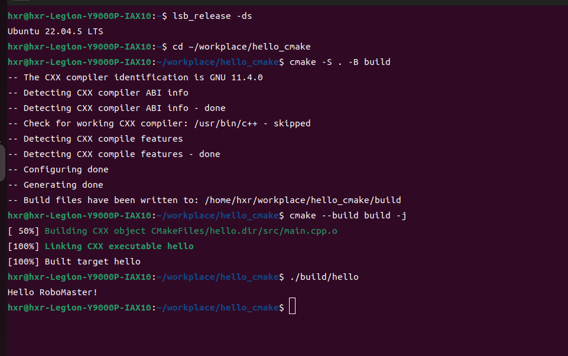

# Hello Cmake

## 环境
- Ubuntu 22.04 LTS
- CMake 3.22.1
- GCC  11.4.0

## 构建命令
```bash
cmake -S . -B build
cmake -build build
```

## 运行命令
```bash
./build/hello
```

## 预期输出
终端输出 “Hello RoboMaster!"



*图1：在终端运行 hello 程序成功输出 Hello RoboMaster!*

